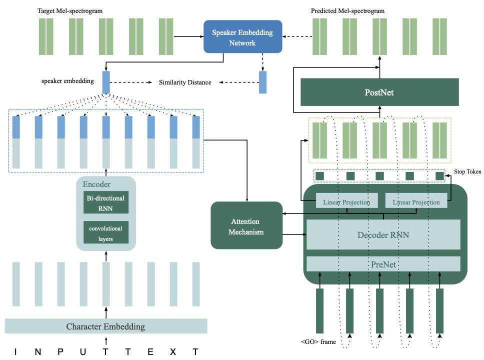
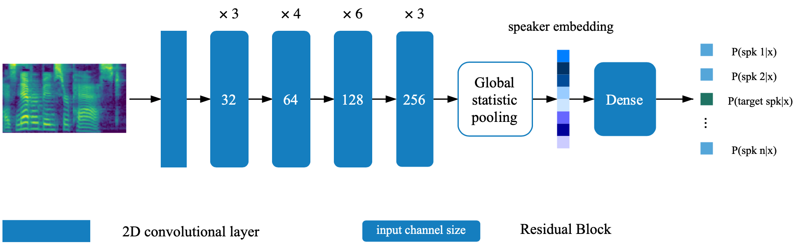

# Multispeaker Speech Synthesis with Feedback Constraint from speaker verificaiton

This is a tensorflow implementation of the multispeaker TTS network introduced in paper [From Speaker Verification to Multispeaker Speech Synthesis, Deep Transfer with Feedback Constraint](https://arxiv.org/abs/2005.04587). This repository also contains a deep speaker verification model that is used in multi-speaker TTS model as the feedback network. [Synthesized samples](https://caizexin.github.io/mlspk-syn-samples/index.html) are provided online.

## Citation

```
@inproceedings{Cai2020,
  author={Zexin Cai and Chuxiong Zhang and Ming Li},
  title={{From Speaker Verification to Multispeaker Speech Synthesis, Deep Transfer with Feedback Constraint}},
  year=2020,
  booktitle={Proc. Interspeech 2020}
}
```

# Model Architecture




#### where the speaker embedding network is a ResNet-based network:




---

# Training

### Speaker verification model

The speaker verification model is located in directory [deep_speaker](https://github.com/caizexin/tf_multispeakerTTS_fc/tree/main/deep_speaker). By default setting, the speaker verification model is trained with data [Voxceleb 1 and Voxceleb 2](http://www.robots.ox.ac.uk/~vgg/data/voxceleb/index.html). You can find the file list in the directory. Hyperparameters are set in [vox12_hparams.py](https://github.com/caizexin/tf_multispeakerTTS_fc/blob/main/deep_speaker/vox12_hparams.py). 

To train the speaker verificaiton model from scratch, prepare the data as listed in file list and run:

```shell
CUDA_VISIBLE_DEVICES=0 python train.py
```

### TTS synthesizer (without feedback control)

By default setting, the synthesizer is trained using dataset [VCTK](https://datashare.is.ed.ac.uk/handle/10283/3443). 

- Extract audio feature using [process_audio.ipynb](https://github.com/caizexin/tf_multispeakerTTS_fc/blob/main/process_audio.ipynb)

- Extract speaker embeddings using ipython notebook [deep_speaker/get_gvector.ipynb](https://github.com/caizexin/tf_multispeakerTTS_fc/blob/main/deep_speaker/get_gvector.ipynb)

- Train a baseline multispeaker TTS system

  ```shell
  CUDA_VISIBLE_DEVICES=0 python synthesizer_train.py vctk datasets/vctk/synthesizer
  ```

- Feel free to evaluate and synthesize samples using [syn.ipynb](https://github.com/caizexin/tf_multispeakerTTS_fc/blob/main/syn.ipynb) during training

### Neural vocoder (WaveRNN)

By default setting, the vocoder is also trained using dataset [VCTK](https://datashare.is.ed.ac.uk/handle/10283/3443). It would be easy after you have the acoustic feature extracted from the previous section (**TTS synthesizer**). For better performance, please use GTA Mel-spectrogram obtained by vocoder_preprocess.py after the synthesizer training is finished.

```shell
CUDA_VISIBLE_DEVICES=0 python vocoder_train.py -g --syn_dir datasets/vctk/synthesizer vctk datasets/vctk
```

### TTS synthesizer with feedback constraint

- Set the path to the two pretrained model (the speaker verification model and the multispeaker synthesizer) by changing the corresponding keys in [hparams.py](https://github.com/caizexin/tf_multispeakerTTS_fc/blob/main/feedback_synthesizer/hparams.py). 

- Train the model and evaluate anytime with [feedback_syn.ipynb](https://github.com/caizexin/tf_multispeakerTTS_fc/blob/main/feedback_syn.ipynb)

  ```shell
  CUDA_VISIBLE_DEVICES=0 python fc_synthesizer_train.py
  ```

# Pretrained-models

* [Speaker embedding network](https://github.com/caizexin/tf_multispeakerTTS_fc/tree/main/deep_speaker/vox12_resnet34_pretrain)
* [Baseline synthesizer 1 (used as the pretrained model for the feedback training)](https://drive.google.com/file/d/15f0TYQ0m2zUYZ5S9rAtFdqMFNFcODGpL/view?usp=sharing)
* [Baseline synthesizer 2](https://drive.google.com/file/d/1vDdpVAStHomfJWnegAXKPgZVCAhr2kOj/view?usp=sharing)
* [TTS synthesizer with feedback constraint](https://drive.google.com/file/d/1Bl5oSiXLHWpbK4ihtPBsFwTu90HoB1dL/view?usp=sharing)
* [WaveRNN vocoder](https://drive.google.com/file/d/1ekJQEyot63Nrfhak-kFAc-jTg6TVMuzX/view?usp=sharing)

---

# References and Resources

* [Rayhane-mamah](https://github.com/Rayhane-mamah)/**[Tacotron-2](https://github.com/Rayhane-mamah/Tacotron-2)**
* [CorentinJ](https://github.com/CorentinJ)/**[Real-Time-Voice-Cloning](https://github.com/CorentinJ/Real-Time-Voice-Cloning)**
* [**On-the-Fly Data Loader and Utterance-Level Aggregation for Speaker and Language Recognition**](https://ieeexplore.ieee.org/document/9036861)
* [**Natural TTS Synthesis by Conditioning Wavenet on MEL Spectrogram Predictions**](https://ieeexplore.ieee.org/document/8461368)
* [**Efficient Neural Audio Synthesis**](https://arxiv.org/abs/1802.08435)

